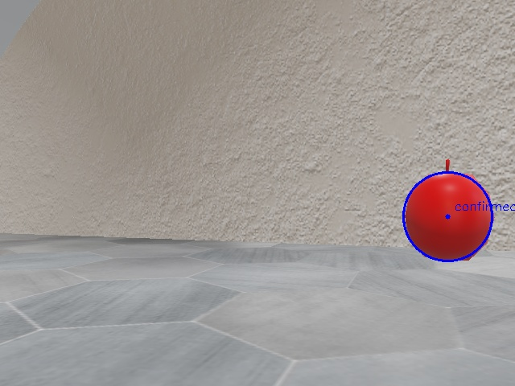
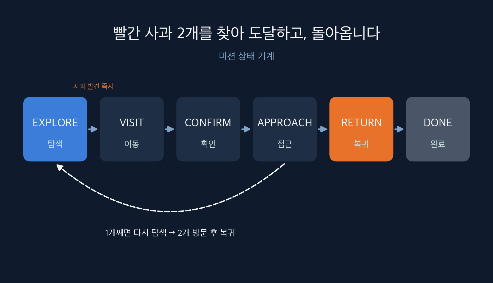

# pnu-techweek-amr — AMR Search & Rescue (부산대 TECH WEEK 2026)

TurtleBot3 Burger(Webots R2025a)가 **지도 없는 아파트**를 스스로 탐색해 **빨간 사과 2개**를 모두 찾아 0.35 m까지 접근한 뒤 **시작 지점으로 복귀**하는 자율주행 스택입니다. 위치 추정·점유 격자·frontier 탐색·A*·DWA의 정석 파이프라인을 NumPy/SciPy/OpenCV로 직접 구현했고(학습 모델 미사용), 실패한 실행마다 저장된 지도로 오프라인 재현해 원인을 수치로 확정한 뒤 해당 단계의 판정 기준만 고쳤습니다.

시연 코드는 태그 `v1.0-hackathon` (main) 입니다.

> **▶ 웹 버전: [blacktae03.github.io/pnu-techweek-amr](https://blacktae03.github.io/pnu-techweek-amr/)** — 완주 영상(9.6배속), 영상과 동기화된 상태 표시, 기술별 시뮬레이터 클립과 실제 코드, 발표 질의응답. 웹 페이지 소스는 `gh-pages` 브랜치에 있습니다.

---

## 1. 미션과 규칙

| 항목 | 내용 |
|---|---|
| 월드 | `worlds/apartment.wbt` (대회 원본, Supervisor 없음) |
| 목표 | 빨간 사과 **2개 모두** 방문(0.35 m 안 접근) 후 시작점 0.2 m 안 복귀 |
| 제약 | 벽·가구·바닥의 다른 사과와 충돌 금지, 움직이는 보행자 회피 |
| 시간 | 제한 없음 (빠를수록 좋음) |
| 로봇 | TurtleBot3 Burger, LDS-01 LiDAR(360°, 3.5 m, 바닥 17 cm), 카메라 640×480 60°(바닥 8.8 cm), 엔코더, 나침반 |
| 평가 | 목표 달성 · 기술 구현 · 주행 안정성 · 창의성 |

---

## 2. 결과

`apartment_gridnav.wbt`(원본 + 지도 Display + Supervisor 진실값 비교) fast 모드. 위치오차·복귀오차는 Supervisor 진실값과의 차이이며, 제출 월드는 Supervisor 없이 동작합니다.

| 실행 (커밋) | 사과 1 발견 / 방문 | 사과 2 발견 / 방문 | 복귀 / 오차 | 위치오차 max | 접촉 | 정지 비율 | 비고 |
|---|---|---|---|---|---|---|---|
| 기준선 (c54afcb, B조 DWA 통합 직후) | — | — | — | 0.12 m | 0 | 33 % | 714 s 사과 0개, 525 s BLOCKED |
| 1차 (21b4945) | — | — | — | 0.12 m | 1 (보라 사과) | 9 % | 622 s 사과 0개 |
| 2차 (d4eea79) | 475 / 493 s | — | — | 0.17 m | 0 | 10 % | 1075 s 1/2 |
| **3차 (ed79dac)** | **203 / 223 s** | **519 / 526 s** | **566 s / 0.10 m** | 0.21 m | **0** | 20 % | 첫 완주 |
| 녹화·시연 (a500408, 실시간) | 203 / 223 s | 533 / 541 s | 582 s / 0.11 m | 0.19 m | 0 | — | 3차와 같은 코드, 보행자 타이밍 차이 |

이전 단계(사과 1개 규칙, 9/30 오후): 발견 233.8 s, 좌표 오차 0.02 m, 복귀 437 s, 위치오차 max 0.14 m, 충돌 0.



---

## 3. 시스템 구조



| 상태 | 하는 일 | 전이 |
|---|---|---|
| EXPLORE | frontier 목표로 주행, 카메라는 3프레임마다 빨간 사과 검사 | 미방문 사과 발견 즉시 → VISIT |
| VISIT | 사과에서 0.7 m 떨어진 지점까지 A* | 도착 → CONFIRM (경로 3회 실패 → 포기, EXPLORE) |
| CONFIRM | 정지, 사과 방향 회전, 같은 기준으로 재탐지, `confirmed.jpg` 저장, 좌표 갱신 | 성공 → APPROACH / 4 s 실패 → 블랙리스트, EXPLORE |
| APPROACH | DWA 대신 look-ahead 추종으로 0.35 m까지, 사과 위치를 장애물로 고정 | 1개째 → EXPLORE, 2개째 → RETURN |
| RETURN | 시작점으로 A* | 0.2 m 안 → DONE |
| SEARCH (폴백) | frontier가 없고 사과가 남았으면 카메라로 못 본 빈칸(반경 1.2 m 기준) 수색 | 후보 생기면 EXPLORE, 없으면 BLOCKED |

매 스텝(64 ms) `webots_adapter.run()`이 아래 모듈을 순서대로 부릅니다. 지도 갱신은 새 LiDAR 스캔(100 ms)마다, 재계획은 1 s마다.

| 단계 | 파일 | 담당 | 핵심 |
|---|---|---|---|
| 위치 추정 | `grid_nav/pose_estimation.py`, `localization.py` | B조 | 엔코더 + 나침반(부호 −1) + 상관 스캔 매칭(±10 cm/2 cm, ±3°/0.5°) |
| 지도 | `occupancy_grid.py`, `exploration.py` | A조 | log-odds 5 cm 격자, 팽창 0.205 m, 강제 장애물 마스크 |
| 탐색 | `exploration.py`, `frontier.py` | A조 | frontier + BFS 경로거리 점수(2배 축소, 도달 0이면 원해상도), 목표 유지, 둘러보기, 카메라 커버리지 층 |
| 전역 경로 | `astar.py` | A조 | 8방향, 벽 근접 비용, 시선 단축, 통과 가능 칸 스냅 |
| 대상 탐지 | `target_detection.py`, `vision.py` | A조 | 색 → 원형도 → 형태 → 기하 → 2프레임, 비빨강 사과 장애물 등록, 빨간 후보 조사 |
| 국소 제어 | `motion_control.py`, `dwa.py` | B조 | DWA: 정적 = 지도 벽 셀(costmap), 동적 = 지도에 없는 스캔 점(여유 0.20 m), 복구 폴백 |
| 미션·통합 | `webots_adapter.py`, `robot_config.py`, `controllers/tb3_gridnav/` | A조 | 상태 기계, 헛바퀴 감지, watchdog, 로그·Display·지도 저장 |

**팀 인터페이스**: pose `(x, y, θ)` [m, rad] · 지도 `int8 grid[row, col]` 0 빈칸/1 벽/−1 미지 + `GridSpec`(해상도 0.05 m) · 경로 `[(x, y), ...]` · 제어 `(v, ω)`.

---

## 4. 기술 구현 요약

### 4.1 지도
칸마다 log-odds 누적(빔 통과 −0.62, 끝점 +0.85, ±4 클램프), 벡터화 갱신 2~3 ms. 팽창 = 로봇 반지름 0.105 + 여유 0.10 m. 지도 크기 시작점 ±20 m. `mark_obstacle`로 찍은 칸은 강제 마스크에 기록해 매 스캔 뒤 다시 벽으로 고정합니다(LiDAR 빔이 빈칸으로 통과하며 1 s 안에 지우던 버그의 수정).

### 4.2 탐색 목표
frontier = 빈칸이면서 8방향 이웃에 미지가 있는 칸, 6칸 미만 군집 제외. 점수 = 3.0×BFS 경로거리(지배적) − 크기·회전 항. 현재 목표가 유효하면 도착 전 교체 금지(새 후보 경로거리가 남은 거리의 50 % 미만일 때만 예외), 반경 3 m 안 후보 우선. 목표 변경 시 주변 2 m에 카메라 미확인 칸이 120개 이상이면 제자리 한 바퀴(5.2 s, 25 s 쿨다운). 축소 BFS가 0.4 m 문을 막으면 원해상도로 재계산. 블랙리스트 90 s 만료.

### 4.3 위치 추정
엔코더 odometry + 나침반 절대각, 상관 스캔 매칭으로 x, y 보정(벽 log-odds>2 우도장, odometry 사전 벌점). ICP는 긴 벽에서 미끄러져 기각. odometry만 쓰던 실행 4.16 m 오차 → 0.14~0.21 m.

### 4.4 대상 탐지 (빨간 사과)

| 단계 | 규칙 | 근거 |
|---|---|---|
| 색 | HSV H 0~6 ∪ 174~180, S ≥ 160, V ≥ 50 | 빨간 사과는 텍스처 없는 순수 빨강, 나무 바닥 S 100~150 |
| 크기 | 반지름 3~130 px | 0.8 m 36 px, 2.5 m 10 px |
| 원형도 | ≥ 0.70 | 사과 0.88~0.92, 캔 0.50, 스티커·카펫 0.45, 소화기 0.36~0.40 |
| 형태 | 종횡비 0.65~1.5, 덩어리 밖 빨강 < 10 % | 소화기 2.1, 가구 빨간 띠 |
| 기하 | 수평선 아래, 반지름 거리 ≈ 세로위치 거리(2배 안) | 멀리 있는 큰 빨간 물체 배제 |
| 확정 | 연속 2프레임, 1.0 m 안 병합 | |

카탈로그(바닥 물체 117개 프레임) 오탐 0, 빨간 사과 2.5 m까지 탐지. COCO 사전학습 YOLO는 시뮬레이터 빨간 사과를 apple로 분류하지 못해 제외. 가구에 가려 반쪽만 보이는 사과를 위해 형태 검사에 떨어진 바닥 위 빨간 덩어리를 '후보'로 기록하고, 현재 목표보다 가까우면 1 m 앞에서 4 s 관찰(후보당 1회, 실패 시 영구 제외).

### 4.5 비빨강 사과 = 낮은 장애물
초록·주황·보라 색 범위로 같은 탐지기를 돌려 2 m 안이면 1프레임 즉시 반경 0.20 m 이상(멀수록 크게) 장애물로 지도에 고정, 가까이 재관측 시 위치 갱신. 방문 완료한 빨간 사과도 0.20 m로 고정. 모든 후진은 뒤 0.5 m가 카메라로 본 곳이거나 10 s 안 지나온 궤적일 때만 허용(아니면 제자리 회전).

### 4.6 국소 제어 (DWA)
정적 장애물 = planner 지도의 벽 셀(로봇 주변 3 m), 동적 = 지도상 자유 칸에 찍힌 스캔 점(사람). 후보 전부 탈락 시 정면이 비어 있으면 0.08 m/s 경로 전진 폴백. APPROACH 구간(마지막 0.7 m)만 look-ahead 추종 + 정면 정지. B조 원 구현(스캔 점 8연속 셀 판정)은 LiDAR 잡음 1.5 cm로 벽 점 26~37 %가 동적으로 남아 실내에서 정체했고, 오프라인 재현으로 확정 후 costmap 입력으로 전환했습니다.

### 4.7 헛바퀴·정체 복구
전진 명령 중 앞뒤 ±40° 빔이 2 s 동안 4 cm 미만 변하면 헛바퀴: odometry 되돌림, 앞 0.25 m 장애물 표시, 3 s 후진. 15 s 위치 진척 없음 watchdog(B조): 앞 0.25 m 표시 후 안전 후진·재계획.

---

## 5. 실패 → 원인 → 수정 (9/30)

| 증상 | 원인 | 수정 | 근거 |
|---|---|---|---|
| 사과 대신 복도 끝 물체로 감 | 크기만으로 거리 추정 | 수평선 규칙, 두 거리 일치, 캘리브레이션 | 시험 사과 오차 6 cm |
| 소화기를 사과로 기록 | 라벨로 갈라진 빨간 조각 | 원형도 0.70, 종횡비, 밖빨강 검사 | 카탈로그 117 오탐 0 |
| 좌표 4 m 오차 | 낮은 물체에 걸려 odometry 가짜 전진 | 스캔 매칭 + 헛바퀴 감지 | 4.16 → 0.18 m |
| 복도에서 헛바퀴 오판 | 전 빔 중앙값 | 앞뒤 빔만, 2 s 확정 | 오판 0 |
| 도착 후 재확인 실패 | 0.4 m에서 사과가 화면 아래로 | CONFIRM 0.7 m → APPROACH 0.35 m | 완주 4회 재확인 100 % |
| DWA 벽 앞 정체(정지 33 %) | LiDAR 잡음 vs 5 cm 셀 8연속 판정, 동적 여유 0.455 m | 이웃 판정 → costmap 입력, 여유 0.20, 전진 폴백 | 정지 9 %, 재현 v≈0 90 → 0 % |
| 벽 옆 사과 0.8 m에서 접근 불가 | DWA 안전거리 | APPROACH만 look-ahead | 0.34~0.35 m 도달 |
| 표시한 장애물이 1 s 만에 지워짐 → 보라 사과 충돌 | LiDAR 빈칸 통과가 log-odds 소거 | 강제 고정 마스크 | 접촉 1 → 0 |
| "frontier 없음"인데 방이 남음 | 4배 축소 BFS가 0.4 m 문을 막음 | 2배 축소 + 원해상도 재계산 | 1번 사과 방 진입 |
| 목표 중도 이탈 35회/실행 | 거리 가중치 약함, 목표 교체 자유 | W_DIST 3.0, 도착 전 교체 금지 | 변경 25회, 미확인 14641 → 8108칸 |
| 가려진 2번 사과 미발견 | 0.9 m 안에서만 보임, '봤다' 반경 2 m | 반경 1.2 m, 빨간 후보 조사, 둘러보기 | 3차·시연 발견 |
| 좁은 방(문 0.4 m) 미진입 | frontier가 팽창 필터에 전부 제외 | 스냅 시도(954072e) → 벽 근처 목표로 접촉 41회 → **되돌림** | 한계로 기록 |

상세 시각·로그는 `docs/WORKLOG.md`, 발표용 정리는 `docs/PRESENTATION.md`.

---

## 6. 실행 방법

```
grid_nav/        알고리즘 모듈 (각 파일 단독 실행 시 자체 테스트)
controllers/     tb3_gridnav = 전체 스택, tb3_catalog = 비전 카탈로그 촬영, tb3_reactive = 강의 Algorithm 3
worlds/          apartment.wbt(대회 원본) · apartment_submit.wbt(심사용: 원본 + controller만 tb3_gridnav)
                 apartment_gridnav.wbt(개발용: + Supervisor 진실값, 지도 Display) · *_catalog/*_vision_*(비전 시험)
protos/          색 사과 PROTO
docs/            WORKLOG · AUDIT · BRANCHES · PRESENTATION · SPEECH · images/
prefetch_assets.py   macOS Webots 에셋 캐시 선다운로드
tests/           B조 2사과 미션 단위 테스트 (python -m unittest tests.test_two_apple_mission)
```

```bash
pip install numpy scipy opencv-python matplotlib        # Python 3.10
python prefetch_assets.py worlds/apartment.wbt          # macOS 최초 1회 (GitHub 에셋 다운로드 실패 대비)

# 심사용 (원본 월드, Supervisor 없음, 시작 pose 상수)
webots --mode=fast --stdout --stderr worlds/apartment_submit.wbt
# 개발용 (지도 Display + 위치오차 로그)
webots --mode=fast --stdout --stderr worlds/apartment_gridnav.wbt
```

Webots Preferences > General > Python command 에 위 패키지가 설치된 파이썬 경로를 넣습니다. 콘솔에 1 s마다 상태·목표·속도·방문 수·헛바퀴·DWA 복구·사과 장애물 수가 찍히고, 지도는 `controllers/tb3_gridnav/map.npz`, 확인 사진은 `confirmed.jpg`로 저장됩니다(모두 .gitignore). 처음 3 s는 스캔 3장을 모으느라 정지합니다.

규칙 상수: `webots_adapter.py`의 `TARGET_COUNT = 2`, `CONFIRM_DIST = 0.70`, `ARRIVE_DIST = 0.35`, `HOME_DIST = 0.2`; 시작 pose `robot_config.START_POSE_APARTMENT = (−0.3, −7.5, π)`.

---

## 7. 알려진 한계

- **좁은 방**: 팽창 0.205 m 뒤 폭 0.4 m 문 안쪽 frontier는 목표가 되지 않습니다. 스냅 시도는 벽 근처 목표로 접촉을 일으켜 되돌렸습니다.
- **가려진 사과**: 가구 뒤 사과는 1 m 안에서만 보여 발견이 늦습니다(2번 사과 519~533 s).
- **시간 예산 없음**: 제한 시간이 없다는 규칙에 맞춰 두 사과를 못 채우면 SEARCH → BLOCKED로 끝나며 조기 복귀하지 않습니다.
- **보행자**: 동적 점 여유 0.20 m로 회피하지만 CONFIRM 중 시야를 가리는 경우는 재시도로만 대응합니다.
- **소리 상호작용**(로봇 노래 → 사람 외침 → 방향 추정, `feat/sound`): 뼈대만 구현, 규칙 확인 전이라 미병합.

### 다음에 해볼 것 — "귀와 입"이 있는 로봇과 구조 대상

구조 대상(사과)에 **입**(Emitter), 로봇에 **귀**(Receiver)와 **입**(Speaker)을 달아 소리로 상호작용하게 합니다.

1. 로봇이 탐색 중 노래(신호음)를 내보낸다.
2. 그 소리를 "들은" 구조 대상이 "살려주세요!"를 외친다(Emitter 송신).
3. 로봇은 수신 방향과 세기(1/d²)로 소리의 위치를 추정하고, frontier 목표보다 **그 방향을 우선** 탐색한다(GO_TO_SOUND 상태).

의미: 재난 현장에서 카메라로 보이지 않는 위치의 요구조자가 소리를 내면, 로봇이 지도를 다 그리기 전에 그쪽으로 먼저 갈 수 있습니다. "보이는 것"만 찾는 지금 구조에 "들리는 것"을 더하는 확장입니다.

현재 상태: 로컬 브랜치 `feat/sound`(커밋 008825c)에 `worlds/apartment_story.wbt`(로봇 Speaker+Receiver, 구조 대상 노드 Emitter), `controllers/victim_shout`, `grid_nav/sound_localization.py`, 어댑터 `GRIDNAV_STORY=1` 옵션이 뼈대로 있습니다. 심사 월드에 센서를 추가하는 것이 허용되는지 확인 뒤 별도 시연 월드로 진행할 계획입니다.

---

## 8. 문서

| 파일 | 내용 |
|---|---|
| `docs/WORKLOG.md` | 시간순 실패 → 원인 → 해결 기록, 실행별 수치 |
| `docs/AUDIT.md` | 강의 자료 대비 구현·누락·차이 표, 튠 대상 |
| `docs/BRANCHES.md` | 브랜치 = 파일 소유 규칙, PR 규칙 |
| `docs/PRESENTATION.md` | 발표용 7항목 (보여줄 것 → 문제 → 원인 → 수정 → 수치) |
| `docs/SPEECH.md` | 발표 대사 (시연 화면을 보며 설명한 5가지) |
| `docs/images/` | 상태 기계 그림, 확인 프레임, 오탐 사례 |

---

## 9. 팀 역할과 브랜치

| 조 | GitHub | 역할 | 파일 |
|---|---|---|---|
| A조 | [@blacktae03](https://github.com/blacktae03) | 점유 격자·frontier 탐색·A*, 사과 탐지(비전), 상태 기계, **전체 통합**, 문서·발표 | grid_nav/occupancy_grid.py, frontier.py, astar.py, exploration.py, vision.py, target_detection.py, webots_adapter.py, controllers/tb3_gridnav |
| A조 | [@ziuneeeeeee](https://github.com/ziuneeeeeee) | 탐색·비전 파트 공동 개발, 실행 검증 | (A조 공동) |
| B조 | [@mongdmin](https://github.com/mongdmin) | 위치 추정(오도메트리·나침반·스캔 매칭), DWA 국소 계획 | grid_nav/pose_estimation.py, localization.py, motion_control.py, dwa.py |
| B조 | [@badyeun](https://github.com/badyeun) | 위치 추정·DWA 공동 개발, 2사과 미션 로직·watchdog, 테스트 | (B조 공동), tests/test_two_apple_mission.py |

| 조 | 브랜치 (모두 main 병합) |
|---|---|
| A조 | feat/vision (PR #1), feat/exploration (PR #2), fix/integration (PR #5), docs/readme |
| B조 | feat/localization (PR #3), feat/dwa (PR #4), c54afcb 직접 푸시 |

규칙: main은 PR로만, PR 설명에 판정 수치(발견 시각·좌표 오차·복귀 오차·충돌). 상세는 `docs/BRANCHES.md`.

**저작권 주의**: 강의 PDF·노트북(강사 저작물)은 이 저장소에 포함하지 않습니다. `worlds/`·`protos/`·`controllers/tb3_teleop*` 등 강의 배포 자산은 원본 그대로입니다.
